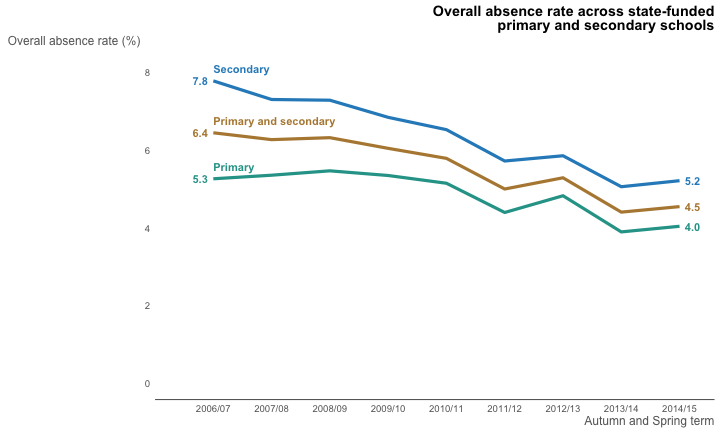

```{r setup, include=FALSE}
options(htmltools.dir.version = FALSE)

knitr::opts_chunk$set(echo = TRUE, warning= FALSE, message = FALSE, fig.height = 5)
```

```{r, package load, echo = FALSE}
library(gapminder)
library(tidyverse)
library(gganimate)
```


## Learning outcomes

- Make different types of plots such as scatter plots, bar plots, histograms, box plots, area plots and density plot
- Easily make subplots of your data with faceting 
- Arrange plots in a grid
- Customise your plots

---
## How do GDP and life expectancy change over time?

```{r plot, echo = FALSE}
ggplot(data = gapminder, aes(x = gdpPercap, y = lifeExp,  size = pop, colour = continent)) +
  geom_point(alpha = .7) +
  facet_wrap(~ continent) +
  scale_colour_brewer(palette = "Dark2") +
  scale_size(name = "Population") +
  guides(colour = "none") +
  scale_x_log10() +
  labs(title = 'Year: {frame_time}', x = 'GDP per capita', y = 'Life expectancy') +
  transition_time(year)
```

---
## Layers
Just like Ogres and onions, ggplots have layers. 

Simple plots have only a few layers and as we build more layers the plots get more complex...  

```{r, echo = TRUE, eval = FALSE}

ggplot(data = <DATA>, mapping = aes(<MAPPINGS>)) + 
  <GEOM_FUNCTION>()

```

<iframe src="https://giphy.com/embed/kwafZfFxw8WnC" width="480" height="255" frameBorder="0" class="giphy-embed" allowFullScreen></iframe><p><a href="https://giphy.com/gifs/shrek-kwafZfFxw8WnC">via GIPHY</a></p>

---
## Data, x, y


``` {r}
ggplot(data = gapminder, aes(x = gdpPercap, y = lifeExp))
```

---
## Type of plot

``` {r}
ggplot(data = gapminder, aes(x = gdpPercap, y = lifeExp)) +  
  geom_point()
```

---
## Colour and size

``` {r}
ggplot(data = gapminder, aes(x = gdpPercap, y = lifeExp,  
                             colour = continent, size = pop)) +  
  geom_point()
```

---
## Adjusting the colour, size, etc: scales

``` {r fig.height = 4}
ggplot(data = gapminder, aes(x = gdpPercap, y = lifeExp,  
                             colour = continent, size = pop)) +  
  geom_point() +  
  scale_colour_brewer(palette = "Dark2")
```


---
## Making subplots: facets

``` {r fig.height = 3.7}
ggplot(data = gapminder, aes(x = gdpPercap, y = lifeExp,  
                             colour = continent, size = pop)) +  
  geom_point() +  
  scale_colour_brewer(palette = "Dark2") +  
  facet_wrap(~ continent)
```

---
## Adjusting the axis titles

``` {r fig.height = 3.5}
ggplot(data = gapminder, aes(x = gdpPercap, y = lifeExp,  
                             colour = continent, size = pop)) +  
  geom_point() +  
  scale_colour_brewer(palette = "Dark2") +  
  facet_wrap(~ continent) +  
  labs(x = "GDP per capita", y = "Life expectancy")
```

---
## Adjusting the overall plot look: theme

``` {r fig.height = 3.2}
ggplot(data = gapminder, aes(x = gdpPercap, y = lifeExp,  
                             colour = continent, size = pop)) +  
  geom_point() +  
  scale_colour_brewer(palette = "Dark2") +  
  facet_wrap(~ continent) +  
  labs(x = "GDP per capita", y = "Life expectancy") +
  theme_classic()
```


---
# Accessibility for colour blind people
```{r include =FALSE}
library(ggplot2)
library(ggthemes)
```

```{r, out.width=350}
p <- ggplot(mtcars) + geom_point(aes(x = wt, y = mpg,
         colour = factor(gear)))

p + theme_igray() + scale_colour_colorblind()
```
---
# Stata theme
```{r, out.width=350}
ToothGrowth$dose <- as.factor(ToothGrowth$dose)
bxp <- ggplot(ToothGrowth, aes(x = dose, y = len)) +
  geom_boxplot(aes(fill = dose))

bxp + theme_stata() + scale_fill_stata()
```

---

# Economist theme

```{r,include=FALSE}
   p <- ggplot(mtcars) +
         geom_point(aes(x = wt, y = mpg, colour = factor(gear))) +
         facet_wrap(~am) +
         # Economist puts x-axis labels on the right-hand side
         scale_y_continuous(position = "right")
```

```{r, out.width=350}
    ## Standard
    p + theme_economist() + scale_colour_economist()
```

---
# Excel theme
```{r excel theme, out.width=350}
p <- ggplot(mtcars) +
         geom_point(aes(x = wt, y = mpg, colour = factor(gear))) +
         facet_wrap(~am)
    p + theme_excel_new() + scale_colour_excel_new()
```

---
# Govstyle theme
Graphs in official statistics have to look a certain way. We need to ensure they meet the Government Statistical Service standards.


---
## Plotly package for interactive plots


<iframe src="https://giphy.com/embed/hdCGbAPTVbxTi" width="480" height="270" frameBorder="0" class="giphy-embed" allowFullScreen></iframe><p><a href="https://giphy.com/gifs/reaction-friends-excited-hdCGbAPTVbxTi">via GIPHY</a></p>

---
## Start by loading the packages 

```{r, library load }
# this is where the starwars dataset lives 
library(dplyr)
#this is what we plot with 
library(ggplot2)
# this makes our plots interactive
library(plotly)
```

We are going to use the starwars dataset here so lets see what it looks like 

```{r, starwars}
head(starwars)
```

---
## Make a simple plot 
```{r first starwars plot}
 ggplot(data = starwars)+
                   geom_point(aes(x = height, y = mass, colour = gender))
```

---
## Plotly that plot
```{r plotly startwars plot}
starwars_plot <-  ggplot(data = starwars)+
                   geom_point(aes(x = height, y = mass, colour = gender, 
                                  label = name))

ggplotly(starwars_plot)
```

---
## Use plotly instead of a legend
```{r}
starwars2 <- starwars %>% 
  ggplot(data = .,)+
  geom_bar(aes(x = gender, fill = eye_color))+
   theme(legend.position="none")
ggplotly(starwars2)

```


---
## EmoGG

```{r}
#devtools::install_github("dill/emoGG")
library(emoGG)

ggplot(iris, aes(Sepal.Length, Sepal.Width, color = Species)) +
  geom_emoji(emoji="1f337")
```

---
## Useful links/resources


There is lots of useful info online on making plots with ggplot2, but this book is a great starting point:

Wickham, H. and Grolemund, G. (2016) R for data science. Free at http://r4ds.had.co.nz/ It was written by the guy who wrote the package ggplot2. 

Another useful book is this one: http://www.cookbook-r.com/Graphs/

The evolution of a ggplot: 

https://cedricscherer.netlify.com/2019/05/17/the-evolution-of-a-ggplot-ep.-1/

